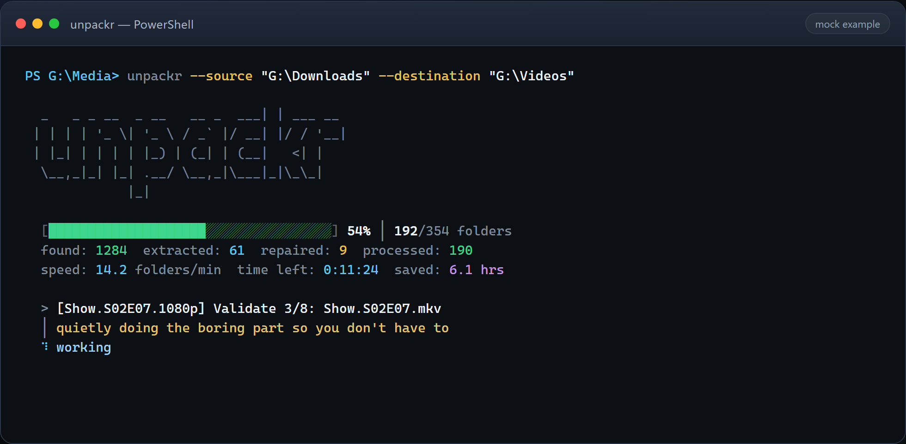

License: Apache 2.0 + Commons Clause (see [`LICENSE`](LICENSE))

Personal/research/sharing use free.

Commercial/enterprise products require separate license from Nick Seal.

# Unpackr

**Version 1.4.0** · August 2026

Unpackr is a local automation tool for processing Usenet-style download folders with safety-first, predictable behavior. It runs on **Windows, Linux, and macOS**.



*Example dashboard mid-run: progress, stats, current folder action, and status line. Paths and counts are illustrative.*

## Why Unpackr

- Reduces manual cleanup: verify, extract, validate, move, and clean in one run.
- Keeps risky operations explicit: fail-closed behavior, preflight checks, and dry-run support.
- Built for operators: clear exit codes, diagnostics, and CI-tested behavior.

## Requirements

- **OS:** Windows, Linux, or macOS
- Python `3.11+`
- Required: [7-Zip](https://www.7-zip.org/) / `p7zip` (`7z` or `7zz` on PATH)
- Recommended: [par2cmdline](https://github.com/Parchive/par2cmdline), [ffmpeg](https://ffmpeg.org/)

Minimum supported versions:
- `7z` / `7zz`: `22.0+` (required)
- `par2`: `0.8.1+` (recommended)
- `ffmpeg`: `4.4+` (recommended)

Package-manager examples:

```bash
# Debian / Ubuntu
sudo apt install p7zip-full par2 ffmpeg

# Fedora
sudo dnf install p7zip par2cmdline ffmpeg

# macOS (Homebrew)
brew install p7zip par2 ffmpeg
```

Windows: install [7-Zip](https://www.7-zip.org/), then put `par2` and `ffmpeg` on `PATH` (or set absolute paths in config `tool_paths`).

## Install

```bash
python -m pip install .
unpackr --help
unpackr-doctor
```

Run `unpackr-doctor` before live processing and resolve blocking issues first.

Developer quality tooling:

```bash
python -m pip install -e .[dev]
pre-commit install
pre-commit run --all-files
```

Current engineering baseline:
- full regression suite required to pass
- `80%` minimum coverage enforced in CI
- stricter Pyright tier on `core/config.py`, `core/file_handler.py`, and `core/safety_invariants.py`
- enforced local + CI gate via `ruff`, `mypy`, `pyright`, `bandit`, `pytest`, coverage, and `pre-commit`

## Quick Start

```bash
# Preview only (no file changes)
unpackr --source "~/Downloads" --destination "~/Videos" --dry-run

# Show plan and exit
unpackr --source "~/Downloads" --destination "~/Videos" --show-plan

# Live run
unpackr --source "~/Downloads" --destination "~/Videos"
```

On Windows, drive-letter paths work the same way:

```powershell
unpackr --source "G:\Downloads" --destination "G:\Videos" --dry-run
```

The option is spelled `--destination`. The common misspelling `--destinantion` is accepted for compatibility, but scripts should use the canonical spelling.

Positional paths are also supported:

```bash
unpackr "~/Downloads" "~/Videos"
```

Source and destination must be provided together. Incomplete or conflicting path arguments fail with a usage error instead of falling into interactive mode.

If the installed launcher is unavailable, run the same command as `python -m unpackr ...` from the repository checkout, then reinstall with `python -m pip install .`.

## Safety

Unpackr is intended to clean messy download folders and produce clean, validated video outputs.
It can perform destructive actions during live runs. Use at your own risk, and run `--dry-run` first.

- Can delete junk, samples, corrupt videos, and empty processed folders.
- Uses conservative decision rules when state is uncertain.
- Handles cancellation (`Ctrl+C`) with guarded shutdown behavior.

Policy details and limits: [docs/SAFETY.md](docs/SAFETY.md)

## Legal And Compliance Notice

Only use Unpackr on files you are allowed to handle.

You are responsible for following the laws, licenses, and rules that apply to your setup (including copyright, privacy, and retention requirements).

Unpackr can move and permanently delete files. You are responsible for backups and for reviewing planned actions before live use.

This project is a technical tool, not legal advice, and is provided "as is." The license terms are summarized at the top of this README, in [`LICENSE`](LICENSE), and in the package metadata.

## Tooling And Exit Codes

- `unpackr`: processing pipeline
- `unpackr-doctor`: environment and dependency checks
- `vhealth`: post-run video health checks (Windows / Linux / macOS; prefers `ffmpeg`)
- Quality gate: `ruff`, `mypy`, `pyright`, `bandit`, `pytest`, `coverage`, `pre-commit`

Exit semantics:
- `unpackr-doctor`: `0` ready, `1` blocked
- `unpackr`: non-zero on validation/setup/processing failures; `--json` emits a run summary
- `vhealth`: non-zero on invalid input/runtime errors (`vhealth --version` for package version)

Contracts: [Exit Codes](docs/EXIT_CODES.md) · [Doctor JSON](docs/DOCTOR_JSON.md)

## Documentation

Detailed documentation is in [`docs/`](docs/README.md).

- [Docs Index](docs/README.md)
- [Roadmap](ROADMAP.md)
- [Platforms (Windows / Linux / macOS)](docs/PLATFORMS.md)
- [Configuration](docs/CONFIGURATION.md)
- [Safety](docs/SAFETY.md)
- [CLI Presentation](docs/CLI_PRESENTATION.md)
- [Troubleshooting](docs/TROUBLESHOOTING.md)
- [Technical Notes](docs/TECHNICAL.md)
- [Quality Gates](docs/QUALITY.md)
- [Build And Install](docs/BUILD.md)
- [Changelog](docs/CHANGELOG.md)
